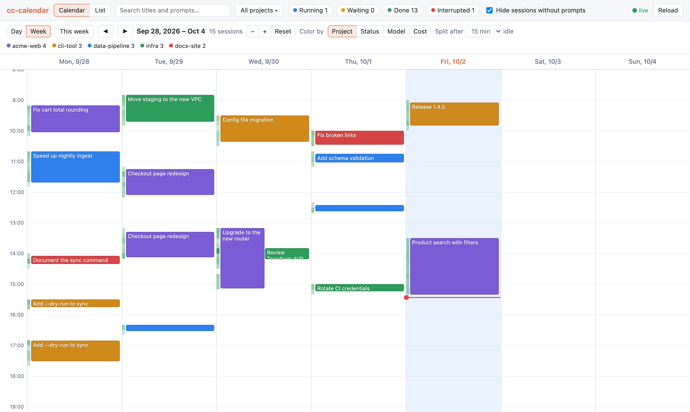
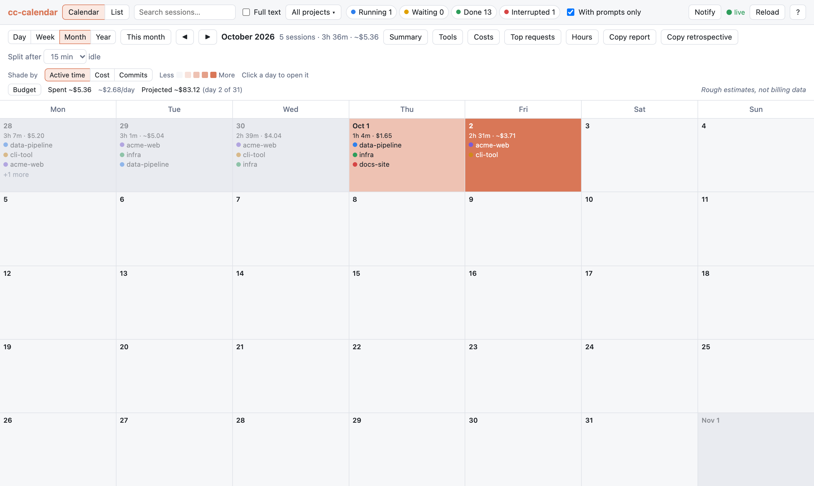
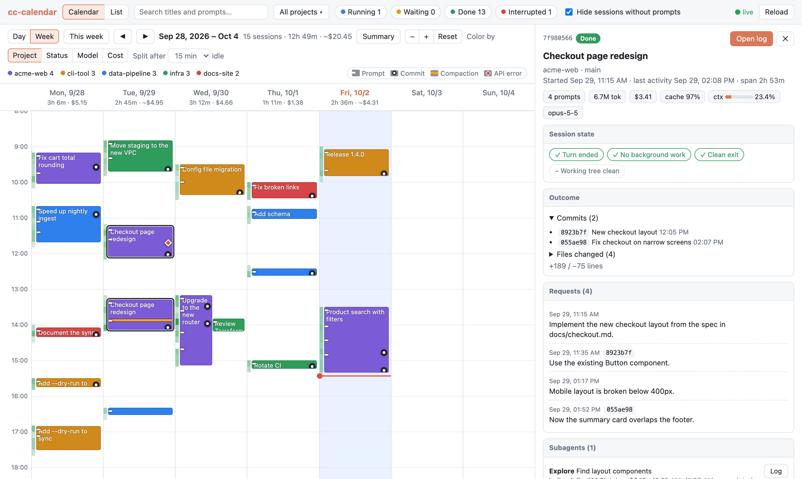
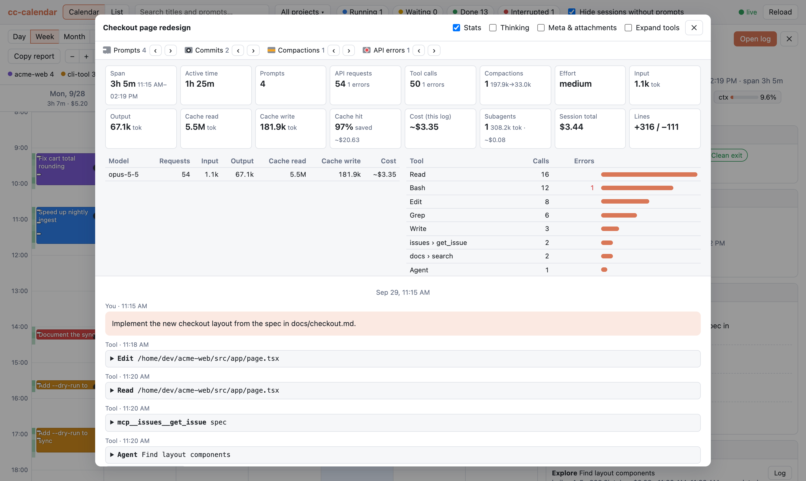
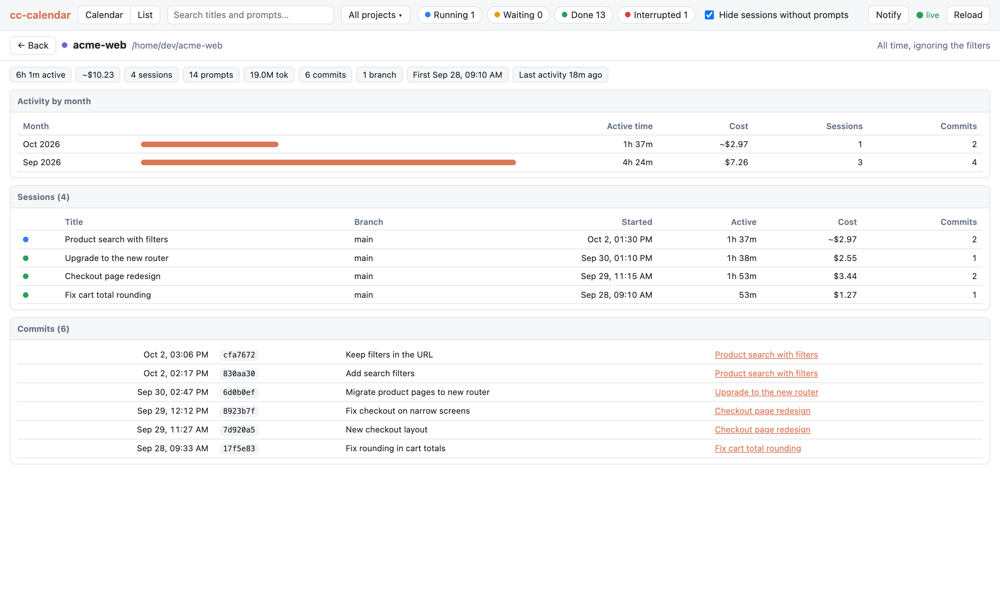
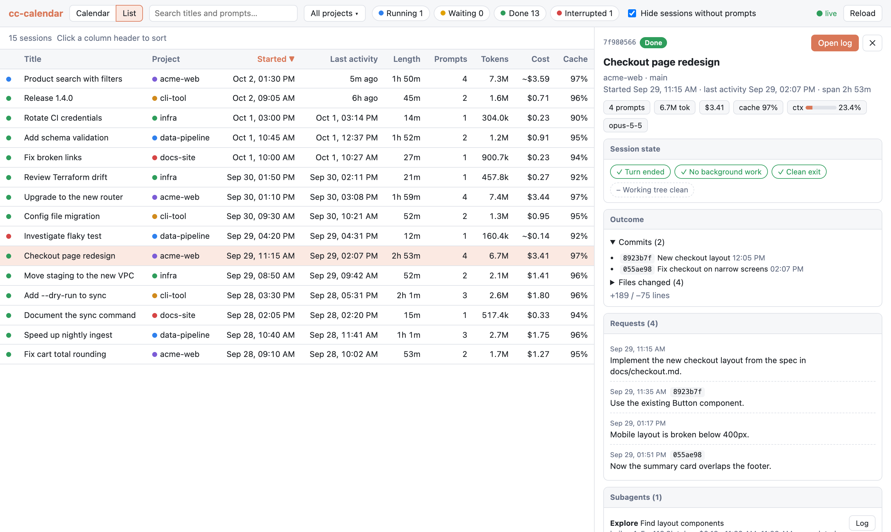
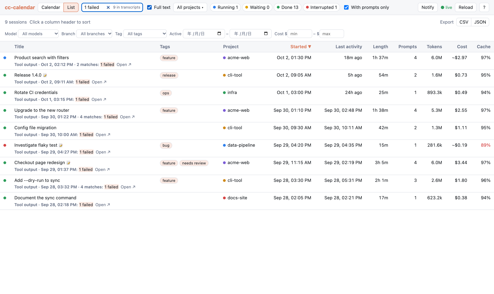

# Features

## Calendar views

- **Week and day calendar**:
    - Each session is drawn as bars covering its active periods.
    - A session is split wherever it sat idle longer than the **Split after** threshold (15
      minutes by default).
    - Overlapping sessions sit side by side.
    - Click a date in the week view to open that day on its own.
    - The day view adds a **Parallel** column: a step line of how many sessions were active (had
      a drawn bar) at each moment, with the day's peak above it. Hover the line for the count and
      the time; hover the header for how long two or more ran at once.
    - Zoom with the − / + buttons or ++ctrl++ / ++cmd++ + mouse wheel; **Reset** goes back to the
      default.
- **Month and year views**: a month calendar and a GitHub-style yearly heatmap, with one cell
  per day.
    - Cells are shaded by active time, cost or commits; switch with "Shade by". Shaded by commits,
      month cells also show the day's commit count.
    - Month cells list the day's busiest projects.
    - The year view adds per-month totals.
    - Click a day to open it in the day view, or a month total to open that month.
- **Monthly budget**: a line under the month view's legend shows the month's spend so far, the
  daily average and, for the current month, the projected month-end total (the daily average so
  far, today included, times the days in the month). Past months show their actual total.
    - Click **Budget** to set a monthly budget. A bar then shows the spend and the projection
      against it, and turns red when the projection is over budget.
    - Set a **Plan price** (such as your subscription's monthly price) to compare: "API equivalent
      \$X vs plan \$Y".
    - Both are kept in this browser's local storage. The figures follow the current filters.
    - These are rough estimates from the logs at API list prices, not billing data.
- **Colors** by project, status, model, effort (the level most requests ran at), source (with
  several config directories), tag or cost
  (< \$1 / \$1–5 / \$5–20 / \$20–50 / ≥ \$50).
    - **Tag** colors a session by its first tag, so put the main one first. Sessions without tags
      are gray. The button shows once any session has a tag.
- **Event marks** on each bar show when prompts, commits, compactions and API errors happened.
    - The tooltip counts them for that block.
    - Click a mark to open the transcript at that point.
    - Click the marks key at the right of the legend to hide or show them.
- **Activity density**: a heat strip behind each day shows prompts and responses per 10 minutes.
- **Live updates**: new log lines are picked up within a second.
- **Views in the URL**: the address keeps the calendar or list view, the span, the date, the
  selected session and the open project page.
    - Reloading the page keeps your place, and you can bookmark a view.
    - The browser's Back and Forward buttons step through range, span and view changes and the
      project page. Selecting a session does not add a step.
    - A bookmark shows the same view on any day. A session or project the logs no longer have is
      left out.

## Time, cost and usage

- **Time and cost totals**:
    - Each date shows that day's active time and cost.
    - The Summary table breaks the displayed range down by project.
    - **Cost per output**: the Summary table also counts each project's commits and pull requests
      in the range, and divides its cost by the commits (**$/commit**). Pull requests carry no
      time, so they count in any range their session was active in.
    - **Compare with previous**: the button above the Summary table shows each project's active
      time, cost, sessions, commits and pull requests next to the previous day, week, month or
      year, with the change (Δ). Hover a change for the previous value. Projects active in only
      one of the two ranges are marked **new** or **absent**. The same filters apply to both
      ranges, and a range still in progress is compared with the whole previous one. "Copy
      report" then adds a line with the change in the totals.
    - A session's cost is split across days by when its requests ran.
- **Working vs waiting**: the Summary table splits active time into **Working**, the time Claude
  spent on its turns, and **Waiting**, the time it waited for your next prompt. **Reply** is the
  median of those waits: how long you took to answer. The detail pane shows the same for one
  session. The rules:
    - A turn runs from your prompt to Claude Code's turn-end record, which also says when the turn
      started (so a prompt you queued while Claude was working starts its own turn). An interrupt
      (Esc) ends a turn too. A turn without either, such as a local command like `/model` or a
      process that was killed, ends at its last log record. A turn still running counts up to
      its latest record.
    - Working time is cut to the drawn bars, like active time: a tool call that ran longer than
      the **Split after** threshold without writing anything is not counted.
    - Waiting is the gap from the end of a turn to your next prompt or command. A gap longer than
      the **Split after** threshold counts as neither working nor waiting: you were away, and
      active time splits there too.
    - A gap that ends with a background task's result (a background agent or shell finishing)
      counts as working: the session was busy with its own work, not waiting for you. A gap
      before a turn that neither you nor a background task started counts as neither.
    - Subagents run inside their parent's turn and are not counted again. A continued session's
      copy of the session it continues is not counted.
    - A range counts the parts of the spans inside it; Reply counts the waits that ended in it.
- **Markdown report**: "Copy report" copies the displayed range as Markdown. The report covers:
    - active time and cost per project
    - each session's title and tags (notes are left out)
    - the commits made in the range

    Issue and PR numbers such as `#12` become links to the repository's `origin` remote.
- **Tool usage**: the Tools pane aggregates tool calls in the displayed range:
    - most used tools, with error counts and rates
    - calls made inside subagents
    - MCP servers
    - subagent runs by type, with their tokens and cost
- **Cost breakdown**: the Costs pane splits the displayed range's cost by model and token type:
    - one stacked bar per model: input, output, cache write and cache read
    - hover a bar segment for its cost and tokens
    - subagent requests count under the model they ran on
    - the week and month views add a row per day, so a spike can be traced to one token type
    - a line with the range's estimated [idle re-cache](#time-cost-and-usage) cost, when there is any

    It follows the current filters. A session with Claude Code's own cost record keeps that
    total, split by the estimate's proportions.
- **What-if cost**: the **What if** section at the bottom of the Costs pane re-prices the
  displayed range as if one model's requests (or all of them) had run on another model:
    - pick the model, the model to price it as, and main thread, subagents or both
    - shows the actual cost, the re-priced cost and the difference
    - target models are those in the price table

    It keeps the same token counts, so it is a rough estimate: a different model or effort
    level would write different amounts. A session with Claude Code's own cost record is
    re-priced at the same ratio of recorded to estimated cost, so both figures compare on the
    same footing.
- **Most expensive requests**: the **Top requests** pane ranks the prompts sent in the displayed
  range by cost.
    - A prompt's cost covers the requests from it until the next prompt, plus the subagents
      started in that span.
    - Each row shows the cost, the prompt, its project and session, when it was sent, tokens, and
      how many requests and subagents it took.
    - The top 10 are shown; **Show all** lists up to 50.
    - Click a row to open the transcript at that prompt.
    - When a session has Claude Code's own cost record, its prompts' estimates are scaled to add
      up to it, so they match the session's cost.
- **Hours of the week**: the Hours pane is a weekday × hour-of-day heatmap of the displayed
  range, to show when you work with Claude Code.
    - Cells are shaded by active time, cost or commits, with the same "Shade by" control as the
      month and year views.
    - Hover a cell for its totals; each row ends with that weekday's total.
    - Hours are in the browser's time zone, and weeks start on Monday like the week view.
    - It follows the current filters.
- **Cache efficiency**: each session shows its cache hit rate and roughly how much caching saved.
  Rates below 90% are highlighted.
- **Idle re-cache**: the prompt cache expires when no request uses it for a while, so the first
  request after a break writes the context to the cache again. cc-calendar estimates what that
  cost.
    - The detail pane shows it per session (**idle re-cache**) and the Costs pane for the
      displayed range. Hover it for the requests and tokens.
    - A request counts when it came longer than the cache lifetime after the previous request of
      the same thread: the main session and each subagent are counted on their own. The lifetime
      is 1 hour when the request's usage shows a 1-hour cache write (Claude Code's main thread
      usually asks for one) and 5 minutes otherwise.
    - Only the part of its cache write that the previous request had cached counts, at the
      difference between the cache write and cache read prices: what a warm cache would have
      saved. Requests after a compaction or a model switch are left out.
    - It is an estimate and always uses the price table, even when the session has Claude Code's
      cost record. The table prices every cache write at the 5-minute rate, so 1-hour writes are
      undercounted.

    `/clear` or `/compact` before a long break is cheaper: the next request then writes a short
    context instead of the whole conversation.

!!! info "About costs"

    Cost comes from Claude Code's own cost record when the session wrote one. Otherwise it is
    estimated from token usage and a built-in price table, and shown with a `~` prefix.

    A continued session's cost record is cumulative: it starts from the previous session's
    totals. So its cost, and its line counts, are its own share: its record minus the previous
    session's last record, following chains of continuations. When that share cannot be told
    (the previous session's log or cost record is gone, or the record is below the previous
    session's), its cost is estimated from its own token usage and its line counts are not
    shown. The cost tooltip says which applies.

    A continued session's log starts with a copy of the end of the previous session's. That copy
    is not counted in the continued session: not its requests, tokens, commits, files, marks or
    active time. Newer Claude Code versions write the copy under the new session's ID, and the
    copy is recognised by its records' prompt IDs. This works even when the previous session's log
    is gone, so its share of the cost is then estimated. It does not work when the copied part
    ends in the middle of a turn.

    In that case, nothing in the log may name the session it continues. So a cost record more
    than 3 times the session's own token estimate, and at least \$1 above it, is also taken to be
    cumulative and treated the same way. Ordinary records stay well below that.

    A session resumed with `claude --resume` keeps its log, but its cost record covers only the
    last run: the totals start again from zero when Claude Code starts. So its cost is that
    record plus an estimate of the token usage, subagents included, from before the last run
    started. It is shown with a `~` prefix because part of it is estimated, and the Summary splits
    it the same way: the days of earlier runs get their estimate and the last run gets the record.
    Its line counts cover only the last run, so they are not shown. A record far above the last
    run's own token usage already counts the earlier runs and is used as it is.

    Treat all costs as rough figures, not billing data. The price table uses Anthropic API list
    prices as of when it was last updated. It does not know about subscription plans, discounts or
    price changes.

## Sessions in detail

- **Status**:
    - Running and Waiting for live sessions; Done or Interrupted for finished ones.
    - The underlying checks are shown: turn ended, no background work left, clean exit and
      working tree clean.
- **Notifications**:
    - Turn on "Notify" in the top bar. The browser asks for permission the first time.
    - You get a desktop notification when a live session goes from Running to Waiting for your
      input, or ends Interrupted.
    - Notifications are sent only while the cc-calendar tab is in the background. Click one to
      open that session.
    - Off by default; the setting is remembered in this browser.
- **Detail pane** shows:
    - tokens, cost and context usage
    - every request you made, with the commits that followed it
    - files changed and pull requests
    - subagents and background tasks
    - links between a session and the one it was continued in
- **Friction**: the **Friction** card counts signs that a session went badly, side by side:
    - **interrupts**: times you stopped Claude with Esc
    - **API errors**: requests that failed, e.g. overloaded or rate limited
    - **queued prompts**: prompts you sent while Claude was still working, which it read before
      its turn ended
    - **failed tool calls**, out of all tool calls, with the error rate. Commands that exited
      non-zero and tool uses you rejected count as failures. Subagents' tool calls are left out:
      their failures are retries you do not see.

    The list view's **Friction** column adds the four counts up, so sorting by it puts the
    roughest sessions first. Hover a cell for the counts. Longer sessions tend to collect more, so
    compare it with the Prompts column.
- **Notes and tags**: the **Notes** card in the detail pane keeps a rating, a note and
  tags for the session. Click **+ Add note or tags** to start.
    - **Rating** rates how the session went: **✓ Done**, **◐ Partial** or **✕ Failed**. One click
      sets it, even while the card is collapsed; click the active one again to clear it.
    - The note is plain text, up to 2,000 characters. It saves when you leave the box, with
      ++cmd+enter++ / ++ctrl+enter++, or with ++esc++.
    - Type a tag and press ++enter++ or a comma to add it; tags already in use are suggested.
      Click ✕ on a tag to remove it.
    - Tags that differ only in case count as one, written the way they were first used.
    - The list view has a **Tags** column and a **Tag** filter, including "(untagged)". A 📝
      next to a title marks a note; hover it to read the start.
    - The list view has a **Rating** column and, once a session is rated, a **Rating**
      filter, including "(unrated)". The Summary adds a line with the active time and cost of the
      sessions rated done, partial and failed, and of the unrated rest.
    - The calendar tooltip shows the rating and tags, and the search box matches notes and tags.
    - They are saved in a file of their own; see
      [Notes and tags](getting-started.md#notes-and-tags) for where.
- **Resume**: "Copy resume command" copies
  `cd <project dir> && claude --resume <session id>`. Paste it into a terminal to pick the session
  up again. Claude Code looks sessions up by the directory they were started in, so the command
  changes to that directory first.
- **Effort and compactions**:
    - The share of requests at each effort level.
    - Each compaction's trigger and context size before → after, e.g.
      `auto · 168k → 32k tokens`.
- **Context size**: the detail pane charts the context each request resent (input, cache
  writes and cache reads) over the session, so you can see where it grew and where it dropped.
    - Amber lines mark compactions. Hover the chart for a request's time and size.
    - The model's context limit is drawn at the top when the peak comes near it.
    - A session is **bloated** when at least 20 requests each resent more than 200k tokens.
      Sessions on a 200k-token window compact before that, so only a larger window lets the
      context grow this far, and each of those requests costs a few times more. The chart
      draws the 200k line, and the list highlights the session's **Peak ctx**.
    - `/clear` starts a new session, so it ends the chart.

- **Transcript viewer**:
    - Markdown rendering and collapsible tool calls. Images linked in a transcript show as links and
      are not loaded (see [Privacy](privacy.md)).
    - Optional thinking and metadata.
    - Drill-down into subagent transcripts.
    - A continued session's transcript starts after the records copied from the session it
      continues, with a note saying how many were left out. Those records are in that session's
      own transcript.
    - A stats panel per transcript, with tokens and cost by model and calls and errors by tool.
      Its active time counts gaps of up to 5 minutes, whatever the calendar's **Split after**
      setting.
    - ‹ › buttons to step through prompts, commits, compactions and errors, and through
      search matches when opened from a full-text hit.
- **List view**:
    - Search over titles, the start of each prompt, notes and tags, or the whole transcripts with
      [full-text search](#full-text-search).
    - Filter by project and status; each status chip shows its count. **With prompts only** (on
      by default) hides sessions in which no prompt was sent. These filters apply to every view.
    - Narrow the list further by model, git branch, source (with several config directories),
      tag, output, date range and cost range. The date range keeps sessions that were active on any day in it.
      **Output → No output** keeps sessions with no commit, pull request or edited file; with a
      minimum cost it lists sessions that cost a lot and produced nothing.
      These filters apply to the list only; the **Clear N filters** button resets them.
    - Sort by any column. **$/commit** is the session's cost divided by its commits; sessions
      without commits show `–` and sort last. Its tooltip counts commits, pull requests, edited
      files and lines.
    - **Avg ctx** and **Peak ctx** are the average and largest context per request. Peak ctx
      is highlighted for bloated sessions (see **Context size** above).
- **Project page**: click a project name to open it. Project names can be clicked in the list,
  the Summary table, the detail pane, and the project menu (**Page**). The page covers all time
  and ignores the filters. It shows:
    - total active time, cost, sessions, prompts, tokens, commits and pull requests
    - cost per commit, and cost per changed line (lines added plus removed). Only sessions with
      Claude Code's cost record know their line counts, so cost per line uses those sessions alone
    - active time, cost, sessions and commits per month
    - every session of the project; click one to open its details
    - the commit history, newest first, with links to the commits on GitHub or GitLab

    **← Back** or ++esc++ returns to the calendar or list.

- **Export**: download the sessions shown in the list view as CSV or JSON. The file follows
  the current filters and sort order. It covers:
    - start and end (ISO 8601 with your UTC offset) and active time
    - project, source config directory, branch, status and rating
    - prompts, tokens, cost, cache hit rate and idle re-cache cost
    - model, effort, Claude Code version
    - commits, pull requests, edited files, lines added and removed, and cost per commit
    - friction: interrupts, API errors, queued prompts, tool calls and failed tool calls
    - average and peak context per request, and whether the context was bloated
    - tags and note

    See [Export format](export.md) for the fields and the JSON envelope.

## Full-text search

The search box matches titles, the start of each prompt, notes and tags. Tick **Full text** next
to it to also search the transcripts themselves:

- What is searched: prompts and slash commands, assistant replies, tool inputs (commands, file
  paths, edits), tool output, errors, background task results, and subagent transcripts.
  Thinking is not searched.
- Queries need at least 3 characters. Case and line breaks are ignored, and words in Japanese
  and other languages without spaces match too.
- A matching session shows a snippet of its first hit, with where it was (e.g. "Tool output"),
  when, and how many matches the session has, including how many are in subagent transcripts
  (e.g. "11 matches (2 in subagents)"). The snippet appears in the list, the calendar tooltip
  and the detail pane.
- **Open ↗** opens the transcript at the hit. **Matches** in the transcript steps through every
  match in it.
- The toggle is remembered. The other filters still apply, and the status at the right of the
  search box counts hits over all sessions.

The text is kept in a SQLite index on disk. It is built in the background the first time, which
takes a while for large logs; until it is done the status says "indexing" and results fill in as
it goes. After that it is updated as logs grow, and a restart reads only new lines. The index is a
cache and safe to delete; it is rebuilt on the next start.

| Platform | Default location |
| --- | --- |
| macOS | `~/Library/Caches/cc-calendar/search.db` |
| Linux | `$XDG_CACHE_HOME/cc-calendar/search.db` (`~/.cache/…` when unset) |
| Windows | `%LOCALAPPDATA%\cc-calendar\search.db` |

`--search-index PATH` puts it elsewhere. It takes a little under half the space of the logs it
covers. If the file cannot be written, the index is kept in memory and rebuilt on each start; if
your Python's SQLite lacks FTS5 with the trigram tokenizer (SQLite 3.34 or later), the status reads "Full text unavailable" and the
rest of the search still works.

## Keyboard shortcuts

Press ++"?"++ or click **?** in the top bar for this list. Button tooltips show their key too.

| Keys | Action |
| --- | --- |
| ++arrow-left++ / ++arrow-right++ | Previous / next day, week, month or year (calendar view) |
| ++t++ | Back to today, this week, month or year (calendar view) |
| ++d++ / ++w++ / ++m++ / ++y++ | Day / week / month / year span, switching to the calendar view |
| ++c++ / ++l++ | Calendar / list view |
| ++slash++ | Focus the search box |
| ++j++ / ++k++ | Next / previous session: by start time in the day and week views, in row order in the list |
| ++enter++ / ++o++ | Open the selected session's transcript |
| ++esc++ | Close the topmost thing: shortcut list, transcript, project menu, search box, detail pane, project page |

Keys typed in a form field go to the field, and only ++esc++ works there. Leaving the search
box with ++esc++ keeps its text.

While a transcript is open, these keys work instead:

| Keys | Action |
| --- | --- |
| ++n++ / ++p++ | Next / previous event: prompt, commit, compaction or API error |
| ++bracket-right++ / ++bracket-left++ | Next / previous prompt |
| ++s++ | Show or hide Stats |
| ++e++ | Expand or collapse tool calls |
| ++b++ | Back to the parent session from a subagent's transcript |
| ++arrow-up++ / ++arrow-down++, ++page-up++ / ++page-down++, ++space++ | Scroll |
| ++esc++ | Close the transcript |

++"?"++ shows both lists here too.
